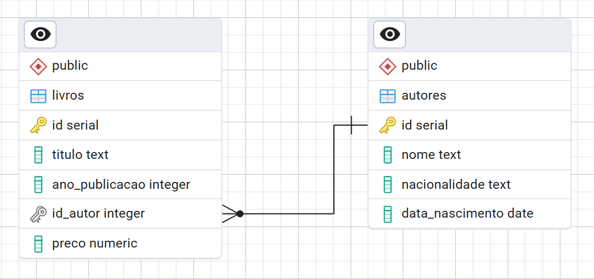

📁 Exercício 3.13.1: Criação de um Esquema Básico de DB
=======================================================

**Desafio:** O objetivo deste exercício é criar um esquema de banco de dados relacional para um sistema de gestão de livros, aplicando os conceitos de Modelagem de Dados Relacionais e comandos DDL. Aqui o SGBD que está sendo usado é o PostgreSQL.


## Conceitos Praticados

-   **Comandos DDL:** Uso de `CREATE DATABASE` e `CREATE TABLE` para definir a estrutura do banco de dados.

-   **Modelagem de Dados:** Criação de tabelas (`autores`, `livros`) e estabelecimento de uma relação de **um-para-muitos** (1:N) entre elas.

-   **Restrições de Integridade:** Uso de `PRIMARY KEY`, `NOT NULL` e `FOREIGN KEY` para garantir a validade e a consistência dos dados.

## Código SQL


```
CREATE TABLE IF NOT EXISTS autores(
	id SERIAL PRIMARY KEY,
	nome TEXT NOT NULL,
	nacionalidade TEXT NOT NULL,
	data_nascimento DATE NOT NULL
);

CREATE TABLE IF NOT EXISTS livros(
	id SERIAL PRIMARY KEY,
	titulo TEXT NOT NULL,
	ano_publicacao INT NOT NULL,
	id_autor INT NOT NULL, -- É do tipo INT para ser consistente com a chave primária
	preco DECIMAL NOT NULL,
	FOREIGN KEY (id_autor) REFERENCES autores(id)
);

```
O código completo você pode encontrar **[clicando aqui](../codigo.sql)**

## Diagrama de Entidade e Relacionamento (DER)


## Análise:

A chave estrangeira (`id_autor`) na tabela livros é crucial para a integridade dos dados. Ela estabelece uma regra que cria um vínculo direto com a chave primária (`id`) da tabela autores. Essa restrição garante que não seja possível inserir um livro com um id_autor que não exista na tabela de autores.

Por padrão, a restrição `FOREIGN KEY` também define os comportamentos `ON DELETE NO ACTION` e `ON UPDATE NO ACTION`. Esses comportamentos impedem que um autor seja deletado ou tenha seu id alterado enquanto houverem livros vinculados a ele. Isso assegura a consistência e integridade dos dados, prevenindo registros "órfãos".