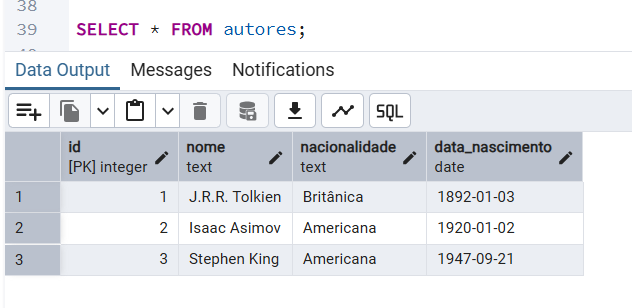
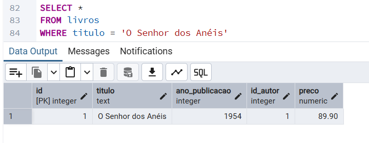
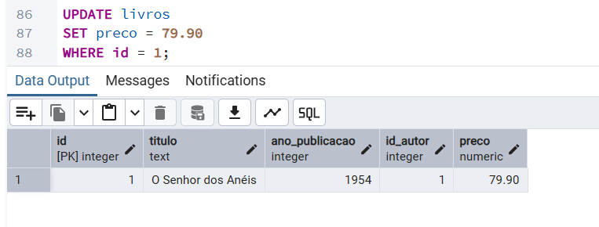
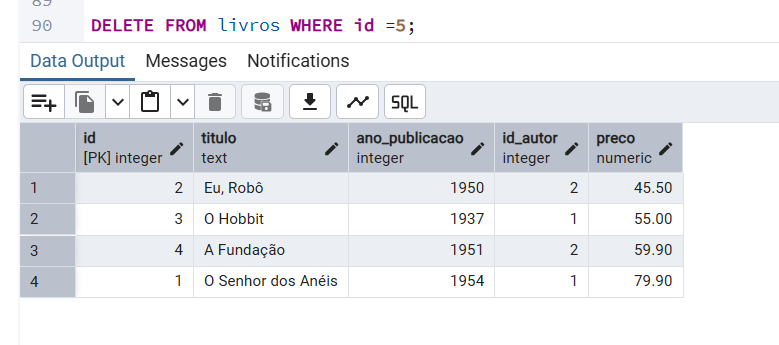
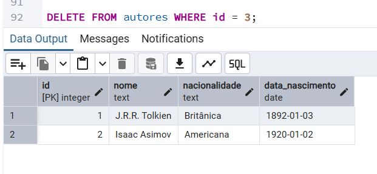

📁 Exercício 3.13.2: CRUD Completo
==================================

**Desafio:** O objetivo deste exercício é praticar as operações de manipulação de dados essenciais para o dia a dia de um desenvolvedor: **CRUD** (`Create`, `Read`, `Update`, `Delete`).

## Conceitos Praticados

-   **Comandos DML:** Uso de `INSERT` para criar registros, `SELECT` para ler dados, `UPDATE` para atualizar, e `DELETE` para remover.

-   **Integridade:** Aplicação de cláusulas `WHERE` para garantir que as operações de atualização e deleção afetem apenas os registros desejados.

## Código SQL

```
INSERT INTO autores (
	nome,
	nacionalidade,
	data_nascimento
)
VALUES
	(
		'J.R.R. Tolkien',
		'Britânica',
		'1892-01-03'
	),
	(
		'Isaac Asimov',
		'Americana',
		'1920-01-02'
	),
	(
		'Stephen King',
		'Americana',
		'1947-09-21'
	);


INSERT INTO livros (
	titulo,
	ano_publicacao,
	id_autor,
	preco
)
VALUES
	(
		'O Senhor dos Anéis',
		1954,
		1,
		89.90
	),
	(
		'Eu, Robô',
		1950,
		2,
		45.50
	),
	(
		'O Hobbit',
		1937,
		1,
		55.00
	),
	(
		'A Fundação',
		1951,
		2,
		59.90
	),
	(
		'A Torre Negra: O Pistoleiro',
		1982,
		3,
		75.00
	);

SELECT * FROM autores;

SELECT * FROM livros;

SELECT *
FROM livros
WHERE titulo = 'O Senhor dos Anéis';

UPDATE livros
SET preco = 79.90 
WHERE id = 1;

DELETE FROM livros WHERE id =5;

DELETE FROM autores WHERE id = 3;

```
O código completo você pode encontrar **[clicando aqui](../codigo.sql)**

## Output das Consultas

### Consulta `autores`:


### Consulta `livros`:


### Consulta com `WHERE`:


### Exemplo de atualização com `UPDATE`:


### Removendo um livro com `DELETE`:


### Removendo um autor com `DELETE`:



## Análise

Este exercício validou o domínio das quatro operações essenciais de manipulação de dados. Através dos comandos `INSERT`, `SELECT`, `UPDATE` e `DELETE`, foi possível demonstrar a capacidade de gerenciar o ciclo de vida dos dados nas tabelas autores e livros.

O uso rigoroso da cláusula `WHERE` em todas as operações de atualização e deleção foi fundamental para garantir a integridade do banco de dados, afetando apenas os registros desejados e evitando a perda de dados.