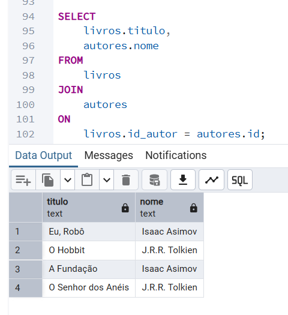
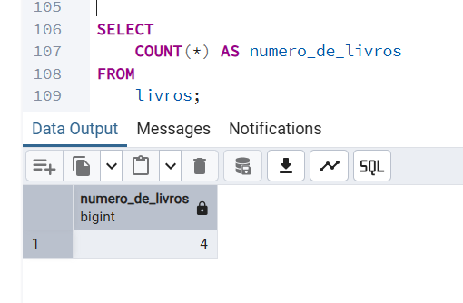
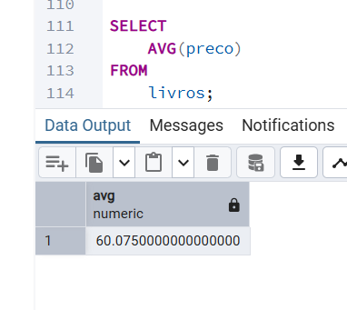
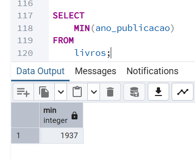
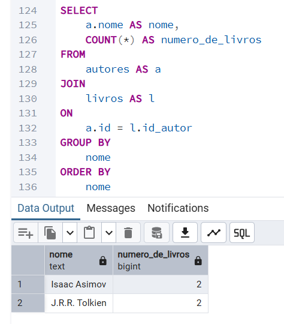
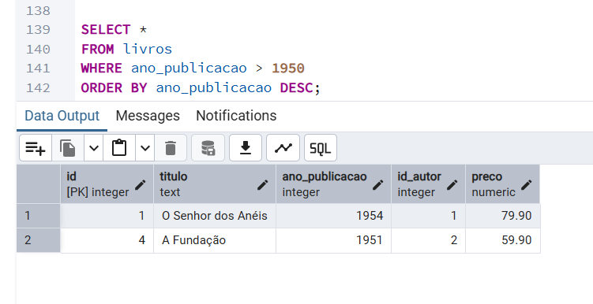

**Desafio:** O objetivo deste exercício é praticar consultas SQL mais complexas, usando ferramentas DQL avançadas para combinar e analisar dados de múltiplas tabelas.

## Conceitos Praticados

-   **DQL Avançado:** Uso de `JOIN` para unir tabelas, funções de agregação (`COUNT`, `AVG`) para resumir dados, e `GROUP BY` para realizar cálculos por categorias.

-   **Cláusulas:** Aplicação de `WHERE` para filtrar e `ORDER BY` para ordenar os resultados.

-   **Aliasing:** Uso de `AS` para criar apelidos para tabelas e colunas, tornando as consultas mais legíveis.

## Código SQL


```
SELECT
	livros.titulo,
	autores.nome
FROM
	livros
JOIN
	autores
ON
	livros.id_autor = autores.id;


SELECT
	COUNT(*) AS numero_de_livros
FROM
	livros;


SELECT
	AVG(preco)
FROM
	livros;


SELECT
	MIN(ano_publicacao)
FROM
	livros;


SELECT
	a.nome AS nome,
	COUNT(*) AS numero_de_livros
FROM
	autores AS a
JOIN
	livros AS l
ON
	a.id = l.id_autor
GROUP BY
	nome
ORDER BY
	nome;


SELECT *
FROM livros
WHERE ano_publicacao > 1950
ORDER BY ano_publicacao DESC;

```
O código completo você pode encontrar **[clicando aqui](../codigo.sql)**

## Resultado


### Consulta com JOIN:


### Consulta total de livros com COUNT:


### Consulta média de preço com AVG:


### Consulta do ano de publicação mais antigo com MIN:


### Consulta com GROUP BY e ORDER BY:


### Consulta com WHERE e ORDER BY:



## Análise


Neste exercício, o foco foi na transformação de dados brutos em informações úteis. Através da cláusula `JOIN`, foi possível combinar o título dos livros com o nome dos seus autores, que estavam em tabelas separadas.

O uso de funções de agregação como `COUNT` e `AVG`, em conjunto com o `GROUP BY`, demonstrou a capacidade de realizar análises estatísticas no banco de dados. Isso permitiu responder a perguntas como "quantos livros cada autor tem", o que é uma habilidade fundamental para extração de insights em projetos de dados.